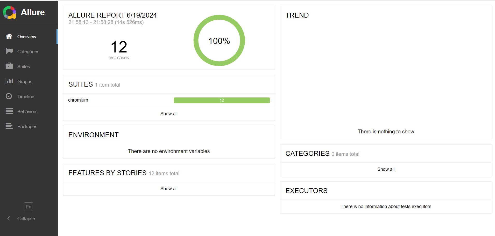

```markdown
# Saucedemo Playwright E2E Tests

## 🎯 Objetivo:
O objetivo da realização dos testes e2e é verificar a funcionalidade de uma plataforma que simula um e-commerce ([Saucedemo](https://www.saucedemo.com)). 
Nesta suíte de testes, é possível validar:
- Login
- Produtos
- Filtros
- Detalhamento de produtos
- Adicionar itens ao carrinho
- Conferir e validar registros do cliente
- Realizar checkout

## 📋 Sobre o projeto:
### 🛠️ Tecnologias utilizadas:
- Playwright
- PageObect
- faker-js
- Allure Report

## 🚀 Como executar o projeto:

### 1. Clonar o repositório:
```sh
git clone https://github.com/MaxKimura/Saucedemo-Playwright.git
```

### 2. Instalar dependências:
```sh
npm install
```

### 3. Instalar o Playwright:
```sh
npx playwright install
```

### 4. Executar a suíte de testes:
```sh
npx playwright test
```

### 5. Executar a suíte de testes com navegador visível:
```sh
npx playwright test --headed
```

### 6. Allure Report:
Allure é uma poderosa ferramenta de relatório que oferece uma visualização clara dos resultados dos testes. Com ele, é possível gerar relatórios detalhados e de fácil interpretação.

Para gerar e visualizar o relatório Allure:

Gere o relatório:
```sh
npm run allure:report
```

Abra o relatório:
```sh
npm run allure:open
```



